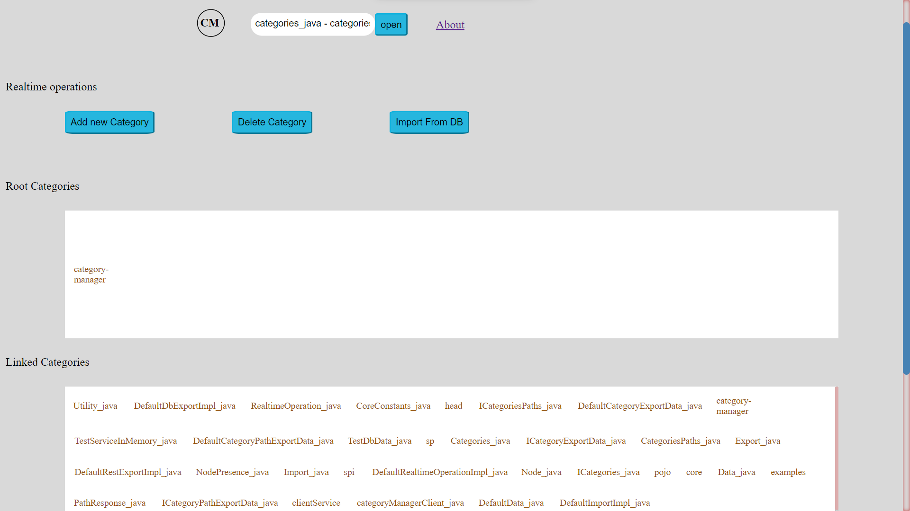
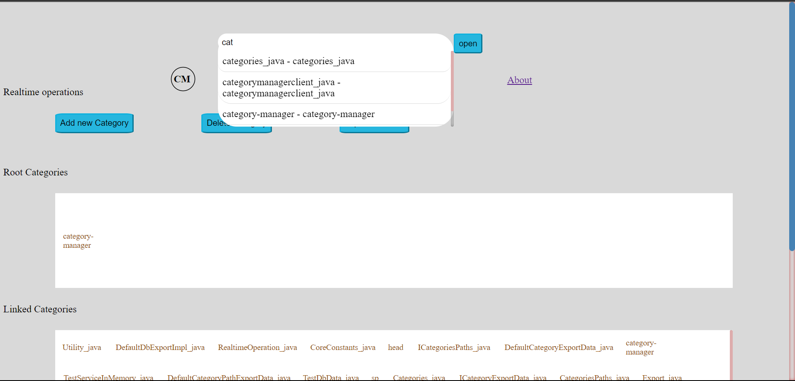
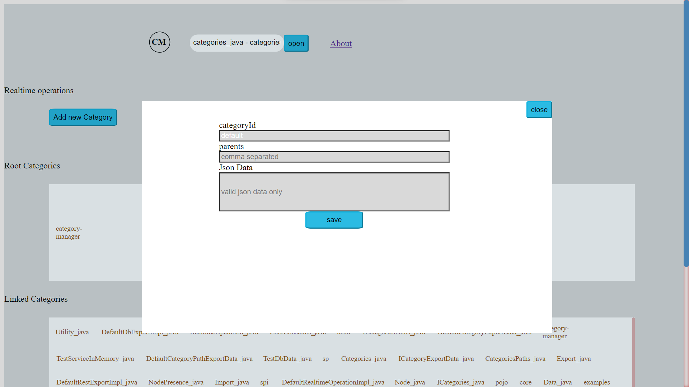
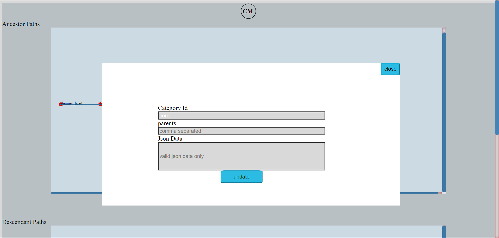
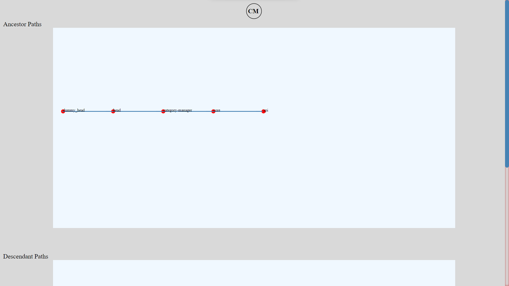
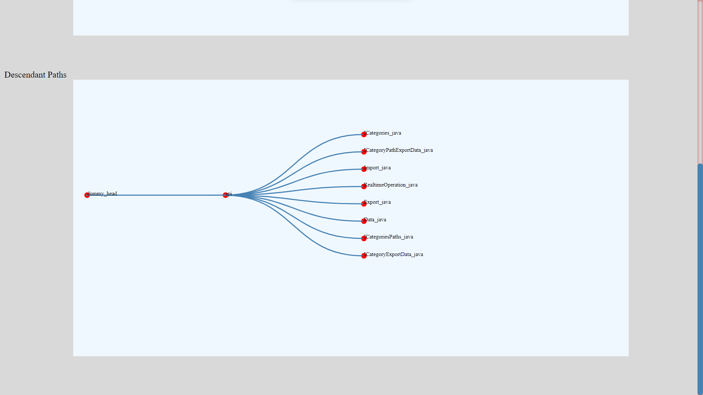

# PRODUCT DETAILS

## INTRO
This application serves two purposes, one it demonstrates some of the features of <a href="https://github.com/category-manager/category-manager" target="_blank" > Category Manager library</a>.
Two, it's also a tool that lets you do some basic data manipulation and searching of the hierarchical information stored in your application.

## Technology used
The application is built using Angular and D3.js for data visualization, spring-boot service to service as backend
which uses CATEGORY-MANAGER for its categorical data management.

Postgres Db is used to store and retrieve the category information. Caffeine cache is used to cache some of the API
response that are expensive. 

## Features
- The application provides features like Typeahead to find the category you are trying to find, each type-ahead query will 
 yield at most 35 possible suggestions or matches.

- Lets you import category information from db using Category-manager lib. There are apis to generate ancestor, descendant paths.
 
- You can make CRUD operations on your hierarchical data using rest APIs . Overall an intuitive backend service built using 
some interesting algorithms and data-structures.

- You will see some interesting data-visualization for the ancestor and descendant paths for the categorical data as well.

## Screenshots

##### 

    <h3>Thank you !</h3>
    
<b> Thank you for taking interest, hope my work contributes to your application, makes life easier and becomes part 
    of your programming journey ^ ^ </b> 

    

    Your feedback, suggestion, contribution would be very valuable to me. So let me know if any :)

##### 

    <h3>Let's Stay Connected !! </h3>
    <ul>
        <li>
            Here is the link to my <a href="https://www.linkedin.com/in/sudarshan-bhat-52052a173/" target="_blank"> LinkedIn </a>
        </li>
        <li>
            You can write to me <a href="mailto:sudarshanrbhat.srb2@gmail.com" target="_blank"> on Gmail  </a>
        </li>
    </ul>

